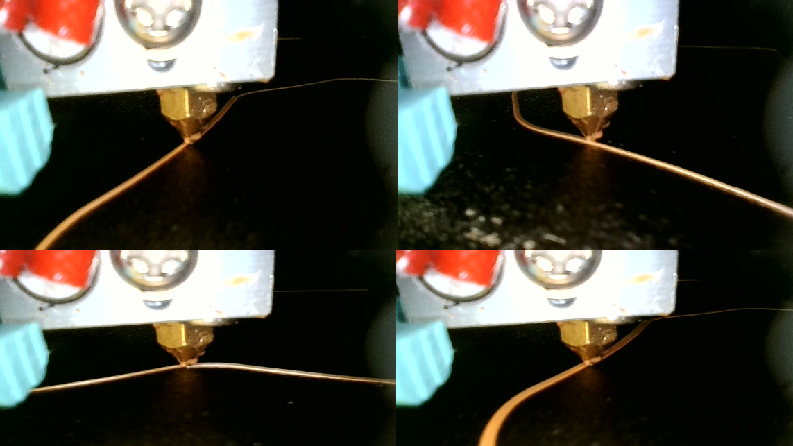

# Early Detection of 3D Printing Issues

## Description

This project aims to develop a system for the early detection of issues in 3D printing processes. By analyzing various parameters and monitoring the printing process in real-time, the system can identify potential problems and provide timely alerts, allowing users to take corrective actions.

    

## Results
These are our results reported by the Kaggle challenge page:

| Submission       | Private Score | Public Score |
| ---------------- | ------------- | ------------ |
| *submission_1*   | 0.83022       | 0.4388     |
| *submission_2*   | 0.73655       | 0.44432    |
| *submission_3*   | 0.86629       | 0.52654    |

**submission_1** was our very first result.
For **submission_2**, we increased the number of *convolution layers* and *dense layers*, and also significantly increased the *dropout* amount to attempt to counter the overfitting.
For **submission_3**, we used the same model as submission_2, but reverted to a random train-test split (instead of retaining a printer).

There is quite a big discrepancy between the private and public score here. There are multiple possible reasons for this. The most likely explanation is that this low public score is the consequence of **overfitting**.

If we indeed have overfitted, it would not be surprising, since we only have data for 7 printers (which is way too small a sample considering how different the images look from one printer to another).

Some of the ways we could have addressed this overfitting are :
- Employ cross-validation
- Explore additional data augmentation
- Use even more aggressive dropout
- Fine-tune hyperparameters (batch size, learning rate, optimizer settings...)

It is also worth noting we have uncovered a problem in the provided data from the start: the target is constant throughout a print_id. This means that every image in a print which ended up having an under extrusion problem is labeled as having under extrusion. You can quickly identify a problem here : even if there is no under extrusion visible in an image, it might be labeled otherwise because the under extrusion might happen later in that same print !
One way to tackle this would have been to 'group' all images of a same print as a single input of the model, but this would not have been a viable option due to how tiny that would have made the sample.

For time-related reasons, we have not attempted to train our model more than 3 times, since this can easily last a couple of hours. 
